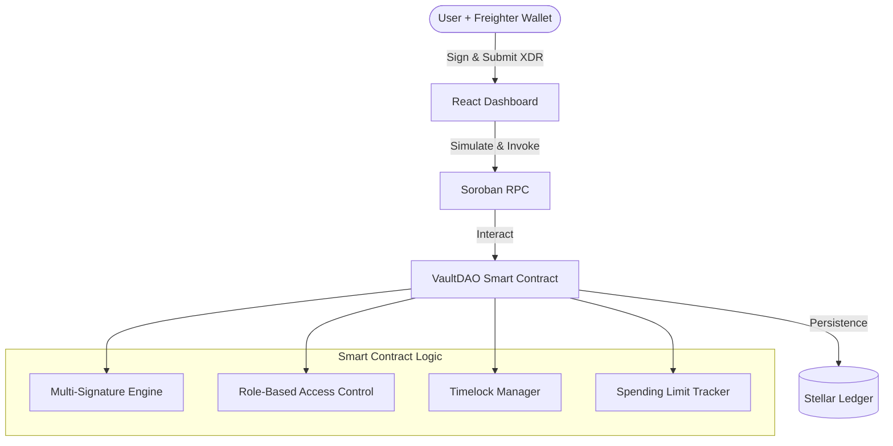

# VaultDAO Architecture

VaultDAO is a decentralized treasury management platform built on the Stellar network using Soroban smart contracts. This document outlines the technical architecture, component interactions, security model, and **production-readiness status** of each contract feature area.

## System Overview

The system consists of three main layers:

1.  **Soroban Smart Contracts**: Core logic for multi-sig, RBAC, and treasury management.
2.  **Frontend (React/TypeScript)**: User interface for managing vault operations.
3.  **Stellar Network (Testnet/Mainnet)**: The underlying infrastructure for transaction finality and data storage.

## Smart Contract Architecture (Rust)

The smart contract is written in Rust using the `soroban-sdk`. It is organized into several modules:

- **`lib.rs`**: Main entry point containing public contract functions.
- **`types.rs`**: Definitions for data structures like `Proposal`, `Role`, and `Config`.
- **`storage.rs`**: Helpers for managing Instance, Persistent, and Temporary storage.
- **`errors.rs`**: Custom error codes for the vault logic.
- **`events.rs`**: Standardized events emitted during contract execution.
- **`test.rs`**: Comprehensive unit and integration test suite.

### Storage Strategy

VaultDAO optimizes for ledger rent by using a hybrid storage model:

| Storage Type   | Usage                            | Rationale                                                        |
| :------------- | :------------------------------- | :--------------------------------------------------------------- |
| **Instance**   | `Config`, `Roles`                | Data that is consistently needed by every invocation.            |
| **Persistent** | `Proposals`, `RecurringPayments` | High-value data that must persist indefinitely.                  |
| **Temporary**  | `Daily/Weekly Limits`            | Ephemeral data that can be evicted after the time period passes. |

## Frontend Architecture (React)

The frontend is a modern SPA built with Vite, React, and Tailwind CSS.

- **Hooks**: Custom hooks (e.g., `useVaultContract`) encapsulate interaction with the Soroban RPC.
- **Context**: Manages wallet connection state (Freighter) and global configuration.
- **Components**: Modular UI components for proposal creation, list views, and status tracking.
- **Styling**: Responsive design using Tailwind CSS with glassmorphism aesthetics.

## Security Model

Security is central to VaultDAO's design:

1.  **M-of-N Multisig**: Proposals require a threshold of approvals from authorized signers before they can be executed.
2.  **Role-Based Access Control (RBAC)**:
    - `Admin`: Can manage roles and update configuration.
    - `Treasurer`: Can propose and approve transfers.
    - `Member`: View-only access (planned).
3.  **Timelocks**: Transfers exceeding the `timelock_threshold` are locked for a delay (e.g., 24 hours/2000 ledgers). This provides a window for legitimate signers to cancel malicious or accidental proposals.
4.  **Enforced Limits**: Spending limits for daily and weekly windows ensure that even if a key is compromised, the maximum drain is capped.

## Data Flow: Proposal Lifecycle

1.  **Propose**: A `Treasurer` creates a proposal via the frontend.
2.  **Approve**: Other `Treasurers` review and approve the proposal until the `threshold` is reached.
3.  **Timelock (Optional)**: If the amount is large, the proposal enters a `Timelock` state.
4.  **Execute**: After approvals are met and timelock expires, any authorized user can execute the transfer.
5.  **Finalize**: The contract transfers the assets to the recipient and marks the proposal as `Executed`.

---

## Contract Feature Readiness

The contract has a broad feature surface. This section maps each area to its current readiness level so contributors know where to focus.

### Readiness Levels

| Level | Meaning |
| :---- | :------ |
| ✅ **Core-Ready** | Battle-tested, fully covered by tests, safe to build on. |
| 🔶 **Stable / Usable** | Works correctly but has known rough edges or limited test coverage. |
| 🧪 **Experimental** | Implemented but not production-hardened; use with caution. |
| 🚧 **Incomplete** | Scaffolded or partially implemented; not safe for production use. |

---

### Feature Readiness Matrix

#### Core Treasury Operations

| Feature | Status | Notes |
| :------ | :----- | :---- |
| Initialization (`initialize`) | ✅ Core-Ready | Single-call setup, fully validated. |
| Propose transfer (`propose_transfer`) | ✅ Core-Ready | Role-gated, limit-checked, audit-logged. |
| Approve proposal (`approve_proposal`) | ✅ Core-Ready | Snapshot-based voting, quorum + threshold enforced. |
| Abstain from proposal (`abstain_proposal`) | ✅ Core-Ready | Counts toward quorum, not threshold. |
| Execute proposal (`execute_proposal`) | ✅ Core-Ready | Timelock, dependency, and condition checks enforced. |
| Cancel proposal (`cancel_proposal`) | ✅ Core-Ready | Proposer or Admin only; spending refunded. |
| Spending limits (per-proposal, daily, weekly) | ✅ Core-Ready | Enforced at proposal creation; temporary storage for windows. |
| Timelocks | ✅ Core-Ready | Configurable threshold and delay; enforced at execution. |
| Recipient allow/block lists | ✅ Core-Ready | Whitelist and blacklist modes supported. |

#### Role & Signer Management

| Feature | Status | Notes |
| :------ | :----- | :---- |
| RBAC (`set_role`, `get_role`) | ✅ Core-Ready | Admin, Treasurer, Member roles enforced. |
| Add / remove signers | ✅ Core-Ready | Threshold re-validated on removal. |
| Role enumeration (`get_role_assignments`) | ✅ Core-Ready | Used by dashboard admin views. |
| Granular permissions (`Permission` enum) | 🧪 Experimental | Types defined; enforcement not wired into all paths. |
| Vote delegation (`delegate_voting_power`) | 🔶 Stable / Usable | Chain-following implemented; limited test coverage. |

#### Proposal Lifecycle Extensions

| Feature | Status | Notes |
| :------ | :----- | :---- |
| Proposal amendments (`amend_proposal`) | 🔶 Stable / Usable | Resets approvals; amendment history stored on-chain. |
| Proposal templates (`create_template`, `propose_from_template`) | 🔶 Stable / Usable | Version-controlled; override bounds enforced. |
| Proposal dependencies (`propose_transfer_with_deps`) | 🔶 Stable / Usable | Circular-reference detection at creation time. |
| Scheduled / delayed execution (`propose_scheduled_transfer`) | 🔶 Stable / Usable | Validated against timelock; execution time enforced. |
| Batch proposals (`batch_propose_transfers`) | 🔶 Stable / Usable | Capped at 10 per batch; aggregate limits checked. |
| Veto (`veto_proposal`) | 🔶 Stable / Usable | Veto addresses configured at init; removes from queue. |
| Priority queue ordering | 🔶 Stable / Usable | Low/Normal/High/Critical; used by `get_executable_proposals`. |
| Proposal metadata / tags / attachments | 🔶 Stable / Usable | IPFS CID validation; size caps enforced. |
| On-chain comments (`add_comment`) | 🧪 Experimental | Stored on-chain; no moderation or spam protection. |
| Execution retry (`RetryConfig`) | 🧪 Experimental | Exponential backoff logic present; limited real-world testing. |

#### Recurring & Streaming Payments

| Feature | Status | Notes |
| :------ | :----- | :---- |
| Recurring payments (`schedule_payment`, `execute_recurring_payment`) | ✅ Core-Ready | Interval-based; dedicated test module (`test_recurring.rs`). |
| Pause / resume / cancel recurring payments | ✅ Core-Ready | Status transitions fully tested. |
| Streaming payments (`StreamingPayment`) | 🧪 Experimental | Rate-based accumulation implemented; no production test coverage. |
| Subscription system (`Subscription`, `SubscriptionPayment`) | 🚧 Incomplete | Types and storage defined; execution logic not fully wired. |

#### Governance & Voting

| Feature | Status | Notes |
| :------ | :----- | :---- |
| Simple voting strategy | ✅ Core-Ready | Default; threshold + quorum enforced. |
| Quorum enforcement (`update_quorum`) | ✅ Core-Ready | Absolute count; 0 disables quorum. |
| Dynamic threshold strategies (`ThresholdStrategy`) | 🧪 Experimental | `Percentage`, `AmountBased`, `TimeBased` variants defined; coverage is thin. |
| Weighted / quadratic / conviction voting (`VotingStrategy`) | 🚧 Incomplete | Enum variants exist; only `Simple` is fully implemented. |
| Voting deadline (`extend_voting_deadline`) | 🔶 Stable / Usable | Admin-only extension; enforced at approval time. |

#### Security & Risk Controls

| Feature | Status | Notes |
| :------ | :----- | :---- |
| Audit trail (`AuditEntry`, `create_audit_entry`) | ✅ Core-Ready | Hash-chained entries; dedicated audit test module. |
| Velocity limiting (`VelocityConfig`) | ✅ Core-Ready | Sliding-window rate limit per proposer. |
| Execution conditions (`Condition`, `ConditionLogic`) | 🔶 Stable / Usable | Balance, date, and price conditions; oracle integration required for price checks. |
| Insurance / stake slashing (`InsuranceConfig`, `StakingConfig`) | 🧪 Experimental | Lock and slash logic present; economic parameters need real-world calibration. |
| Pre/post execution hooks | 🧪 Experimental | Hook addresses stored in config; invocation logic present but not hardened. |
| Reputation system (`Reputation`) | 🧪 Experimental | Score affects spending limits; decay logic implemented; no formal audit. |
| Emergency recovery (`RecoveryConfig`, `RecoveryProposal`) | 🚧 Incomplete | Config and types defined; recovery execution path not fully implemented. |

#### Analytics & Observability

| Feature | Status | Notes |
| :------ | :----- | :---- |
| Vault metrics (`VaultMetrics`) | 🔶 Stable / Usable | Cumulative counters updated on execution/rejection/expiry. |
| Gas tracking (`GasConfig`, `ExecutionFeeEstimate`) | 🧪 Experimental | Fee estimates stored per proposal; enforcement is optional. |
| Notification preferences (`NotificationPreferences`) | 🚧 Incomplete | Per-user preferences stored; no off-chain delivery mechanism. |

#### Advanced / Integrations

| Feature | Status | Notes |
| :------ | :----- | :---- |
| Oracle price feeds (`VaultOracleConfig`) | 🧪 Experimental | Config and price data types defined; requires external oracle contract. |
| AMM / DEX integration (`DexConfig`, `SwapProposal`) | 🚧 Incomplete | Types and swap proposal variants defined; execution not implemented. |
| Cross-chain bridge (`bridge.rs`) | 🚧 Incomplete | Module exists but is disabled (`// mod bridge;`). Not safe to use. |
| Funding rounds (`FundingRound`, `FundingMilestone`) | 🚧 Incomplete | Types defined; milestone execution logic incomplete. |
| Escrow (`Escrow`, `EscrowStatus`) | 🚧 Incomplete | Types defined; no complete escrow lifecycle implementation. |

---

### Contributor Priority Guide

If you're new to the codebase or deciding where to focus, use this guide:

**High priority — safe to work on, high impact:**
- Bug fixes and edge-case hardening in the core proposal lifecycle (`propose_transfer`, `approve_proposal`, `execute_proposal`).
- Expanding test coverage for `ThresholdStrategy` variants (`Percentage`, `AmountBased`, `TimeBased`).
- Improving test coverage for vote delegation chains.
- Hardening execution conditions, especially the oracle price path.

**Medium priority — useful but needs care:**
- Completing the `Weighted` and `Quadratic` voting strategies (currently only `Simple` is active).
- Stabilizing the reputation system — the economic parameters need review before any mainnet use.
- Wiring granular `Permission` enforcement into all relevant entry points.
- Completing the subscription system execution logic.

**Lower priority / experimental — coordinate first:**
- Streaming payments: the accumulation model needs a security review before production use.
- Insurance and staking: slash parameters need economic modeling.
- Pre/post execution hooks: the invocation path needs hardening against reentrancy.
- Recovery: the execution path is incomplete; do not rely on this for production vaults.

**Do not build on top of (yet):**
- Cross-chain bridge (`bridge.rs`) — disabled and incomplete.
- AMM/DEX integration — types only, no execution.
- Escrow — lifecycle not implemented.
- Funding rounds — milestone execution incomplete.

> **Note:** Features marked 🚧 Incomplete may have their types and storage keys defined, which means adding them later won't require storage migrations for the scaffolded fields. However, the execution logic is missing or unsafe — do not expose these to end users.
